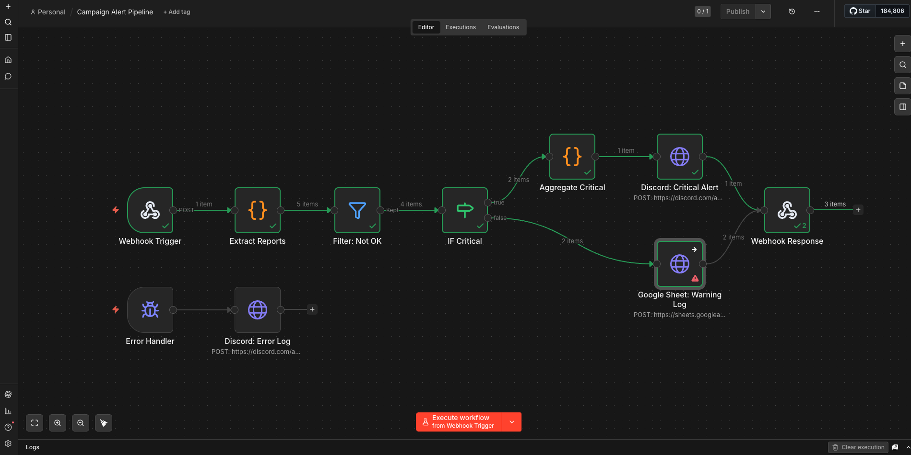
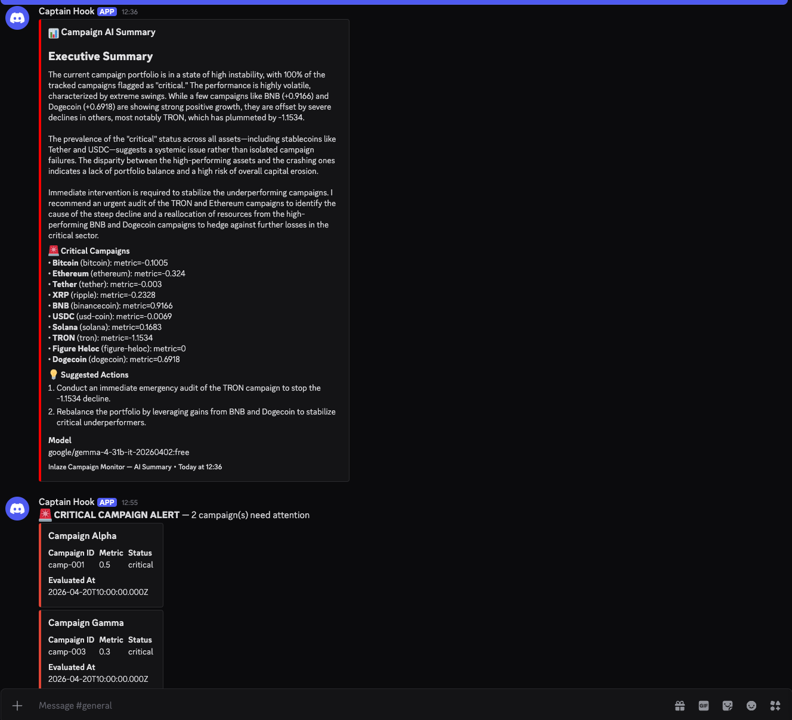

# Inlaze — Prueba Técnica: Desarrollador de Automatizaciones e IA

## Requisitos previos

- **Node.js** v18 o superior
- **npm** v9 o superior
- **Docker** (para correr N8N en la Parte 2)
- **Redis** (opcional, solo para el worker recurrente con BullMQ)
- Una cuenta gratuita en [OpenRouter](https://openrouter.ai/keys) (para la Parte 4 — LLM)
- Un servidor de Discord con un webhook configurado (para notificaciones)

## Instalación

```bash
# 1. Clonar el repositorio
git clone <url-del-repo>
cd inlaze-prueba-tecnica

# 2. Instalar dependencias
npm install

# 3. Configurar variables de entorno
cp .env.example .env
```

Editar `.env` con tus valores reales:

| Variable | Requerida | Dónde obtenerla |
|---|---|---|
| `OPENROUTER_API_KEY` | Parte 4 | [openrouter.ai/keys](https://openrouter.ai/keys) (gratis) |
| `DISCORD_WEBHOOK_URL` | Parte 2 y 4 | Discord → Canal → Editar → Integraciones → Webhooks → Nuevo → Copiar URL |
| `N8N_WEBHOOK_URL` | Parte 2 | Valor por defecto: `http://localhost:5678/webhook/campaign-alerts` |
| `DATABASE_URL` | Parte 3B | Valor por defecto: `file:./dev.db` (SQLite local) |

---

## Parte 1 — Integración de API y Lógica de Negocio

```bash
npm run start:part1
```

Consume la API de CoinGecko, transforma los datos en `CampaignReport[]`, evalúa umbrales y guarda el resultado en `data/campaign-reports.json`. Este archivo es el input para las Partes 2, 3 y 4.

### Elección de API: CoinGecko

Elegí la API pública de [CoinGecko](https://www.coingecko.com/en/api) (`/coins/markets`) por las siguientes razones:

- **Sin autenticación**: el endpoint es público, lo que simplifica el setup y la revisión.
- **Datos numéricos reales**: `price_change_percentage_24h` es un porcentaje que naturalmente simula una métrica de rendimiento (CTR, ROAS) — valores que pueden ser positivos, negativos, altos o bajos.
- **Rate limiting real**: CoinGecko tiene rate limits (~30 req/min en free tier), lo que permite demostrar retry con backoff en un escenario real.

### Mapping conceptual

| CoinGecko | Simulación de campaña |
|---|---|
| Coin (Bitcoin, Ethereum...) | Campaña publicitaria |
| `price_change_percentage_24h` | Métrica de rendimiento (CTR/ROAS) |
| Valores negativos = caída | Campaña con bajo rendimiento |

### Diseño extensible: Adapter Pattern

El sistema usa una interfaz `DataSourceAdapter` que abstrae la fuente de datos. Para agregar Google Ads, Meta Ads, o cualquier otra fuente, se implementa la interfaz con dos métodos: `fetchRawData()` y `transformToCampaignReport()`. El pipeline (`campaign-pipeline.ts`) no cambia — solo se inyecta un adapter diferente.

### Umbrales

Los umbrales están externalizados en `ThresholdConfig`:
- `metric < 1.0` → **critical** (caída severa, acción inmediata)
- `metric < 2.5` → **warning** (tendencia negativa, monitorear)
- `metric >= 2.5` → **ok**

Son configurables sin tocar código. En producción, podrían venir de una base de datos o un panel de configuración.

### Manejo de errores

- **Red caída / timeout**: axios con `timeout: 10000ms`. Si la petición falla, el retry la reintenta.
- **Retry con backoff exponencial**: `withRetry()` implementa `delay = min(base * 2^attempt + jitter, maxDelay)`. Solo reintenta en errores transitorios (5xx, 429, network errors). Los 4xx se propagan inmediatamente.
- **Respuesta inesperada**: `isCoinGeckoMarketItem()` valida la forma del JSON antes de usarlo. Items inválidos se loguean y se saltan.
- **Jitter**: añade aleatoriedad al delay para evitar thundering herd.

---

## Parte 2 — Flujo en N8N

El flujo está exportado en `n8n/campaign-alert-flow.json`.

### Cómo ejecutar

1. **Levantar N8N con Docker:**
   ```bash
   docker run -d --name n8n -p 5678:5678 n8nio/n8n
   ```
2. **Configurar N8N:** Abrir `http://localhost:5678`, crear una cuenta de owner (es local, cualquier dato sirve: `admin@test.com` / `Admin1234`).
3. **Configurar Discord webhook en el flujo:** Antes de importar, abrir `n8n/campaign-alert-flow.json` y reemplazar `YOUR_WEBHOOK_ID/YOUR_WEBHOOK_TOKEN` con tu webhook URL de Discord (aparece 2 veces en el archivo: nodo "Discord: Critical Alert" y nodo "Discord: Error Log"). Luego, en N8N ir al menú **⋯** (tres puntos, arriba a la derecha) → **Import from File** → seleccionar el archivo.
4. **Ejecutar:** Hacer clic en el botón rojo **"Execute workflow from Webhook Trigger"** (parte inferior del editor). El webhook quedará en modo escucha.
5. **Enviar datos:** Inmediatamente, abrir otra terminal y ejecutar:
   ```bash
   npm run webhook:send
   ```
6. **Verificar:** Volver a N8N — los nodos deberían mostrarse en verde. Discord recibirá un mensaje con todas las campañas críticas agrupadas en un solo embed.

> **Nota:** El nodo "Google Sheet: Warning Log" mostrará un error de configuración porque no tiene credenciales de Google Sheets. Esto es esperado — falla graciosamente (`onError: continueRegularOutput`) y no rompe el flujo. En producción se configuraría con credenciales reales.

### Probar ambas ramas (critical + warning)

Los datos reales de CoinGecko pueden generar solo campañas "critical". Para verificar que **ambas ramas** del flujo funcionan, se incluye un payload de prueba con datos mixtos en `n8n/test-mixed-reports.json` (2 critical, 2 warning, 1 ok):

1. En N8N, hacer clic en **"Execute workflow from Webhook Trigger"**.
2. En otra terminal:
   ```bash
   curl -X POST http://localhost:5678/webhook-test/campaign-alerts \
     -H "Content-Type: application/json" \
     -d @n8n/test-mixed-reports.json
   ```
3. Resultado esperado en N8N:
   - **Extract Reports**: 5 items
   - **Filter: Not OK**: 4 items (descarta el "ok")
   - **IF Critical → true**: 2 items → Aggregate → Discord
   - **IF Critical → false**: 2 items → Google Sheet (falla por credenciales, pero recibe los items y continúa sin romper el flujo)
   - **Webhook Response**: 3 items procesados



### Arquitectura del flujo

```
Webhook POST → Extract Reports → Filter (not OK) → IF Critical?
                                                      ├── YES → Aggregate Critical → Discord: Critical Alert
                                                      └── NO  → Google Sheet: Warning Log
                                                                                     │
Error Trigger → Discord: Error Log                              Webhook Response ◄────┘
```

### Nodos

1. **Webhook Trigger**: recibe POST con el JSON de la Parte 1.
2. **Extract Reports** (Code node): desempaqueta el array `reports` en items individuales para procesamiento paralelo.
3. **Filter: Not OK**: descarta registros con `status: 'ok'`.
4. **IF Critical**: bifurca — `critical` va a Discord, `warning` va a Google Sheets.
5. **Aggregate Critical** (Code node): agrupa todas las campañas críticas en un solo payload con múltiples embeds. Esto evita rate limiting de Discord al enviar un único request en lugar de N individuales.
6. **Discord: Critical Alert**: envía un embed rico al canal de Discord con detalles de todas las campañas críticas.
7. **Google Sheet: Warning Log**: registra warnings en una hoja de cálculo para análisis posterior.
8. **Webhook Response**: confirma al caller que el pipeline procesó los datos.
9. **Error Handler + Discord Error Log**: captura errores del flujo y notifica por Discord sin romper la ejecución.

### Conexión con Parte 1

El script `send-to-webhook.ts` lee `data/campaign-reports.json` y lo envía al webhook de N8N. Esto conecta las Partes 1 y 2 en un pipeline end-to-end real:

```bash
npm run start:part1          # Genera los reports
npm run webhook:send         # Los envía a N8N
```

### Decisiones

- Usé **Discord webhooks** en lugar de Slack porque son completamente gratuitos y no requieren crear una app de Slack.
- El Google Sheet se simula via HTTP Request al API de Sheets. Si no se tiene acceso, el nodo falla graciosamente (`onError: continueRegularOutput`).

---

## Parte 3A — Diagnóstico y Refactorización

Archivo: `src/part3a-code-review.ts`

```bash
npm run start:part3a
```

> **Nota:** Las peticiones fallan intencionalmente porque usan `api.example.com` (no existe). Esto es deliberado para demostrar que el manejo de errores funciona correctamente: cada fallo se loguea pero el batch continúa sin romperse.

### Código original (con problemas)

```typescript
async function fetchCampaignData(campaignId: string) {
  const response = await axios.get(`https://api.example.com/campaigns/${campaignId}`);
  const data = response.data;
  return {
    id: data.id,
    clicks: data.clicks,
    impressions: data.impressions,
    ctr: data.clicks / data.impressions   // ← Bug 1: división por cero
  };
}

async function processCampaigns(ids: string[]) {
  const results = [];
  for (const id of ids) {                  // ← Bug 4: loop secuencial
    const campaign = await fetchCampaignData(id);  // ← Bug 2: sin try/catch
    results.push(campaign);
  }
  return results;
}
```

### Problemas identificados

| # | Problema | Impacto | Línea afectada |
|---|---|---|---|
| 1 | **División por cero** | Si `impressions` es 0, `clicks / impressions` produce `Infinity` o `NaN`. Esto corrompe datos downstream. | `ctr: data.clicks / data.impressions` |
| 2 | **Sin manejo de errores** | Si una sola petición falla (red, 500, timeout), `processCampaigns` lanza una excepción y se pierden todos los resultados previos. | `fetchCampaignData` sin try/catch |
| 3 | **Sin validación de respuesta** | Se asume que `response.data` tiene exactamente los campos esperados. Un campo faltante propagaría `undefined` silenciosamente. | `const data = response.data` |
| 4 | **Ejecución secuencial** | El loop `for...of` con `await` procesa campañas una a una. Con N campañas, el tiempo total es N × latencia. | `for (const id of ids)` |
| 5 | **Sin tipado en retorno** | La función retorna un objeto literal sin tipo explícito, perdiendo las garantías de TypeScript. | `return { id, clicks, ... }` |

### Correcciones aplicadas

| # | Corrección | Cómo se implementa |
|---|---|---|
| 1 | **Guard contra división por cero** | `data.impressions > 0 ? data.clicks / data.impressions : 0` |
| 2 | **Try/catch individual** | Cada fetch está envuelto en try/catch. Si falla, se loguea el error y retorna `null`. El batch continúa con los resultados parciales. |
| 3 | **Validación de respuesta** | `isValidApiResponse()` verifica que `id`, `clicks` e `impressions` existan y tengan el tipo correcto antes de usarlos. |
| 4 | **Concurrencia controlada** (diferenciador) | Se reemplaza el `for...of` secuencial por `p-limit(3)` + `Promise.all`. Máximo 3 peticiones simultáneas para respetar rate limits de APIs externas. |
| 5 | **Tipado explícito** | Interface `CampaignData` como tipo de retorno + `CampaignApiResponse` para la respuesta de la API. |

### Función adicional: `getLowPerformingCampaigns`

Filtra campañas con `ctr < 0.02` y ordena de menor a mayor CTR. Implementada como función pura para facilitar testing.

---

## Parte 3B — Query Prisma

Archivo: `src/part3b-prisma-query.ts`

```bash
# Setup de la base de datos (solo la primera vez)
npx prisma generate
npx prisma migrate dev --name init
npm run prisma:seed    # Carga datos de ejemplo

# Ejecutar la query
npm run start:part3b
```

El seed (`prisma/seed.ts`) crea 3 operadores con campañas y métricas de ejemplo. Incluye un operador con métricas de hace +15 días para verificar que el filtro temporal funciona (no debe aparecer en los resultados).

Salida esperada:

```
1. [Operator Alpha] Campaign Facebook Ads → Avg ROAS: 0.7667
2. [Operator Beta] Campaign TikTok Ads → Avg ROAS: 1.1
3. [Operator Alpha] Campaign Google Ads → Avg ROAS: 3.1667
4. [Operator Beta] Campaign Instagram Ads → Avg ROAS: 4.3
```

> **Nota:** "Campaign Old" de Operator Gamma no aparece porque sus métricas son de hace +15 días — el filtro de 7 días la excluye correctamente.

### Qué hace la query

Obtiene las campañas con peor ROAS promedio de los últimos 7 días, agrupadas por operador, ordenadas de menor a mayor ROAS.

### Estrategia

Prisma no soporta `groupBy` + `include` de relaciones + agregados computados en una sola query. Por eso uso un enfoque de dos pasos:

1. **Fetch con filtro**: `findMany` con `where.metrics.some.recordedAt >= 7 días` trae solo campañas que tienen métricas recientes. El `include` de `metrics` también filtra por fecha para no traer datos históricos irrelevantes.
2. **Agregación en aplicación**: calculo el promedio de ROAS en TypeScript y ordeno el resultado.

### Por qué no raw SQL

- La prueba pide explícitamente usar la API de Prisma, no raw SQL.
- Para este volumen de datos, la agregación en aplicación es perfectamente viable.
- En producción con millones de registros, usaría una vista materializada o un `$queryRaw` optimizado con `GROUP BY` + `AVG()`.

---

## Parte 4 — Integración con LLM

Archivo: `src/part4-llm-integration.ts`

```bash
# Modo estándar (espera la respuesta completa)
npm run start:part4

# Modo streaming (tokens en tiempo real)
npm run start:part4 -- --stream
```

Requiere `OPENROUTER_API_KEY` configurado en `.env`. Si `DISCORD_WEBHOOK_URL` también está configurado, el resumen se envía automáticamente al canal de Discord después de generarse.

> **Nota sobre rate limiting:** OpenRouter free tier tiene rate limiting agresivo (~10 req/min). Si la llamada falla con error 429, el sistema reintenta automáticamente con backoff exponencial (2 intentos, 2s base delay). Si persiste, esperar 1-2 minutos y reintentar. El modo `--stream` es más sensible al rate limit porque OpenRouter mantiene la conexión abierta más tiempo. Si el streaming falla repetidamente, probar primero el modo estándar (`npm run start:part4` sin `--stream`) y esperar unos minutos antes de probar streaming. La implementación de streaming funciona correctamente — la limitación es exclusivamente de la cuota gratuita de OpenRouter.

### Proveedor: OpenRouter + Gemma 4 31B

- **OpenRouter**: gateway multi-modelo con capa gratuita. Permite cambiar de modelo sin cambiar código.
- **Gemma 4 31B Instruct (free)**: modelo gratuito con capacidad suficiente para análisis estructurado de datos. No requiere billing.
- La elección del modelo es configurable por parámetro — se puede cambiar a GPT-4o, Claude, o cualquier modelo de OpenRouter sin modificar la lógica.

### Diseño del prompt

El prompt tiene instrucciones concretas y no ambiguas:
1. Identifica campañas critical y explica por qué.
2. Resume el estado de las warning.
3. Sugiere al menos una acción basada en datos.
4. Devuelve un bloque JSON tipado (structured output).

Temperatura: 0.3 (baja) para consistencia analítica.

### Diferenciador: Structured Output

Además del resumen en texto, el LLM devuelve un JSON parseado en `StructuredLLMSummary` con:
- `criticalCampaigns`: array tipado de campañas críticas.
- `suggestedActions`: array de acciones sugeridas.

Si el LLM no devuelve JSON válido, el fallback extrae campañas críticas directamente de los datos originales. El sistema no se rompe.

### Manejo de errores

- Retry con backoff (2 intentos, 2s base delay) — tanto en modo estándar como en streaming.
- Validación de respuesta vacía o malformada.
- Timeout de 30s (estándar) / 60s (streaming) para la llamada al LLM.
- Fallback en parsing de structured output.

### Diferenciador: Streaming

La función `generateCampaignSummaryStream()` (`src/services/llm-summary-stream.ts`) usa SSE streaming nativo de OpenRouter (`stream: true`). Los tokens se imprimen en stdout a medida que llegan, dando feedback inmediato al usuario en lugar de esperar 10-20 segundos por la respuesta completa.

Se activa con el flag `--stream`:

```bash
npm run start:part4 -- --stream
```

Internamente, procesa los chunks SSE línea por línea (`data: {...}\n\n`), extrae el `delta.content` de cada chunk, y acumula el contenido completo para parsear el structured output al final. Retorna el mismo tipo `StructuredLLMSummary` que la versión no-streaming.

### Diferenciador: Resumen LLM → Discord

Después de generar el resumen, el sistema lo envía automáticamente al canal de Discord configurado en `DISCORD_WEBHOOK_URL` — el mismo canal que usa el flujo de N8N para alertas críticas. Esto conecta la Parte 4 con la Parte 2 en un pipeline unificado.

El mensaje usa el formato de **embed** de Discord con:
- Descripción: resumen ejecutivo del LLM
- Campo `🚨 Critical Campaigns`: lista de campañas críticas identificadas
- Campo `💡 Suggested Actions`: acciones sugeridas por el LLM
- Color rojo si hay campañas críticas, verde si todo está OK

Si `DISCORD_WEBHOOK_URL` no está configurado o el envío falla, el sistema continúa sin romperse.



### Diferenciador: Job Recurrente con BullMQ

El worker en `src/jobs/campaign-monitor.ts` convierte la ejecución manual de las Partes 1, 2 y 4 en un **job recurrente** gestionado por BullMQ con Redis como backend.

Cada ciclo ejecuta automáticamente:
1. **Fetch + evaluación** via `runPipeline()` (Parte 1)
2. **Envío al webhook de N8N** (Parte 2)
3. **Resumen con LLM** via `generateCampaignSummary()` (Parte 4)
4. **Notificación a Discord** con el resumen (Parte 4 diferenciador)

Configuración por variables de entorno:
- `REDIS_URL`: conexión a Redis (default: `redis://127.0.0.1:6379`)
- `MONITOR_INTERVAL_MIN`: intervalo en minutos entre ejecuciones (default: `5`)

El worker ejecuta el primer ciclo inmediatamente al arrancar, y luego repite según el intervalo configurado. Maneja shutdown graceful con `SIGINT`/`SIGTERM`.

```bash
redis-server &  # o: docker run -d -p 6379:6379 redis
npm run start:worker
```

---

## Parte 5 — Diseño Conceptual de Agente

Ver [DESIGN.md](./DESIGN.md).

Describe en ~200 palabras cómo diseñar un agente de IA que ejecute acciones automáticas (pausar campañas, enviar alertas) basándose en datos de una base de datos. Incluye:

- **Arquitectura de 4 capas**: LLM (cerebro), Tools (manos), Base de datos (memoria), Audit Log (registro).
- **ReAct pattern**: loop de razonamiento donde el LLM recibe datos, decide y actúa via function calling con tools tipadas (`query_campaigns`, `pause_campaign`, `send_alert`, `adjust_budget`).
- **Diferencia agente vs script**: razonamiento contextual — correlaciona múltiples señales en vez de aplicar reglas fijas.
- **Auditabilidad**: tabla `agent_decisions` con timestamp, input, razonamiento, tool invocada y resultado. Human-in-the-loop gate para acciones destructivas.
- **Diagrama ASCII** de la arquitectura (diferenciador).

---

## Estructura del proyecto

```
├── src/
│   ├── types/
│   │   ├── campaign.ts              # Tipos core: CampaignReport, DataSourceAdapter
│   │   └── llm.ts                   # Tipos LLM: LLMSummary, OpenRouterResponse
│   ├── services/
│   │   ├── coingecko-adapter.ts     # Adapter para CoinGecko API
│   │   ├── campaign-pipeline.ts     # Pipeline genérico de evaluación
│   │   ├── llm-summary.ts          # Servicio de resumen con LLM
│   │   ├── llm-summary-stream.ts   # Servicio de resumen con LLM (streaming SSE)
│   │   └── discord-notifier.ts     # Envío de resúmenes LLM a Discord
│   ├── jobs/
│   │   └── campaign-monitor.ts     # Worker recurrente con BullMQ
│   ├── utils/
│   │   └── retry.ts                # Retry con backoff exponencial
│   ├── part1-api-integration.ts    # Entry point Parte 1
│   ├── part3a-code-review.ts       # Entry point Parte 3A
│   ├── part3b-prisma-query.ts      # Entry point Parte 3B
│   ├── part4-llm-integration.ts    # Entry point Parte 4
│   └── send-to-webhook.ts         # Conecta Parte 1 → Parte 2
├── n8n/
│   └── campaign-alert-flow.json    # Flujo N8N exportado (Parte 2)
├── prisma/
│   ├── schema.prisma               # Schema de Prisma (Parte 3B)
│   └── seed.ts                     # Datos de ejemplo para Parte 3B
├── data/                           # Output generado en runtime
├── DESIGN.md                       # Parte 5: Diseño conceptual de agente
├── .env.example                    # Variables de entorno (template)
└── README.md                       # Este archivo
```

---

## Decisiones técnicas

| Decisión | Alternativa considerada | Razón |
|---|---|---|
| CoinGecko como API | JSONPlaceholder, OpenWeather | Datos numéricos reales con distribución natural, rate limits reales para demostrar retry |
| SQLite para persistencia | PostgreSQL | Cero setup para el evaluador. PostgreSQL sería la elección en producción |
| Discord para notificaciones | Slack | Webhook gratuito sin crear app. Slack requiere más configuración |
| OpenRouter + Gemma 4 | OpenAI, Anthropic | Capa gratuita real. Cambiar de modelo es un string |
| Adapter pattern | Switch/case por fuente | Abierto a extensión, cerrado a modificación. Agregar fuentes = nuevo archivo, no editar existentes |
| dotenv para env vars | Variables inline en comandos | Un solo `.env` para todas las partes. Menos fricción para el evaluador |
| Aggregate en N8N | 1 mensaje por campaña | Evita rate limiting de Discord al enviar un solo request con múltiples embeds |
